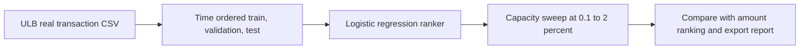
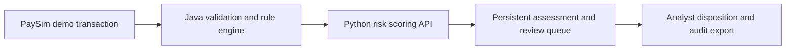

# Risk-Based Fraud Case Triage Platform

This project demonstrates a practical fraud-review problem: **given a fixed number of analyst review slots, which transactions should be reviewed first?** The model benchmark is implemented for the public ULB/Worldline anonymized real-transaction dataset; the report is generated only after the dataset is downloaded and the script is run. A separate PaySim-based service remains as a workflow integration demo for APIs, Java rule strategies, queueing, human dispositions, and audit logging. The simulated service metrics are not used as evidence of model effectiveness.

## Why this is the product idea

Fraud teams cannot manually review every transaction. The useful question is not whether a model can produce a high score, but what it finds under a realistic review limit. The benchmark reports precision, fraud capture, false-positive workload, and transaction amount captured at several queue capacities. A simple amount-descending policy is compared at exactly the same capacity. No time-saving or prevented-loss claim is made because the public dataset contains neither analyst handling times nor confirmed recovered losses.

## End-to-end pipeline

The repository contains two connected engineering demonstrations with distinct data roles. The offline benchmark measures ranking on anonymized real transactions. The interactive case workflow demonstrates how a transaction score is reviewed, dispositioned, and audited using synthetic PaySim records.

### Model evaluation pipeline



### Transaction review pipeline



The Java service also persists assessments to PostgreSQL and publishes events to Kafka. Redis tracks velocity signals. The Python service stores case review events and exposes the analyst queue. Each service is runnable through Docker Compose. The Java middleware is an OOP integration example; its full Docker/JVM build still needs to be verified in an environment with Java and Docker installed.

## Public data and what the results can show

The primary benchmark uses the [ULB/Worldline Credit Card Fraud Detection dataset](https://zenodo.org/records/7395559), a public mirror of the ULB Machine Learning Group dataset. It contains 284,807 anonymized European card transactions from two days in September 2013, with 492 fraud labels (about 0.172%). The two-day window is too short to establish long-term stability, and `V1`–`V28` are anonymized PCA features that are not useful explanations for a human investigator. Those limits are part of the result, not details to hide.

Do not commit the 150 MB data file to Git. Download it from Zenodo into `ml-service/data/raw/creditcard.csv` and run:

```bash
mkdir -p ml-service/data/raw
curl -L 'https://zenodo.org/records/7395559/files/creditcard.csv?download=1' -o ml-service/data/raw/creditcard.csv
cd ml-service
python -m app.real_data_benchmark
```

The benchmark sorts by the source `Time` field and uses the first 60% for training, the next 20% as a validation/monitoring window, and the final 20% as an untouched test window. It trains a transparent Logistic Regression baseline on `V1`–`V28` and `Amount`; it does not oversample the test set, tune a threshold against test labels, or fit a probability calibrator. At each review capacity (0.1%, 0.25%, 0.5%, 1%, 2%), it compares the model with a simple “largest transaction amount first” baseline using the same number of review slots.

`Amount` captured means the sum of labeled fraudulent transaction amounts in the queue. It is **not** loss prevented, money recovered, or net business value. The report also records fraud counts in each chronological split; if a time window has too few fraud examples to support a stable comparison, say so rather than adjusting the split to improve the score.

### Separate workflow integration demo

The existing Python API, Java/Spring Boot service, and analyst dashboard still use the PaySim-derived synthetic transaction schema so the end-to-end queue workflow can be demonstrated with interpretable balance fields. That demo is not the model benchmark, and its synthetic metrics must not be presented as real-world performance. The public ULB benchmark and the PaySim workflow demo are intentionally reported separately because the ULB data has no account identifiers or investigator-readable transaction context; pretending those schemas were interchangeable would create a misleading product demo.

Attribution for the workflow demo: [Flower Labs PaySim-derived dataset card](https://huggingface.co/datasets/flwrlabs/fed-fraud-paysim-banks). It is simulated data and is not evidence of real-world fraud lift.

## Implemented workflow

1. Download the public ULB file and run `python -m app.real_data_benchmark` to generate a chronological, fixed-capacity model comparison at `ml-service/reports/ulb_capacity_benchmark.json`.
2. Run the separate PaySim workflow demo to exercise transaction ingestion, Java OOP rule strategies, Python risk scoring, a review queue, human dispositions, and an audit export.
3. Keep model scores separate from analyst outcomes. The exported feedback is a future labeling/monitoring input; this version does not silently retrain from analyst decisions.

## Repository map

| Path | Role |
|---|---|
| `ml-service/app/real_data_benchmark.py` | Real-data temporal split, logistic baseline, capacity sweep, amount-ranking comparison |
| `ml-service/app/train.py` | PaySim-only synthetic workflow model training and demo queue generation |
| `ml-service/app/main.py` | FastAPI scoring, batch queue, case review, audit and metrics endpoints |
| `ml-service/analyst_app/dashboard.py` | Streamlit analyst queue and disposition UI |
| `ml-service/app/repository.py` | SQLite assessment and append-audited review persistence |
| `transaction-service/src/main/java/.../rules/` | Java strategy interface, amount/balance/velocity rules |
| `transaction-service/src/main/java/.../service/` | Model client, decision policy, PostgreSQL and Kafka orchestration |
| `docker-compose.yml` | Local PostgreSQL, Redis, Kafka, ML API, dashboard and Java middleware |
| `ml-service/reports/evaluation.json` | Historical PaySim demo report, explicitly marked synthetic-only |

The key data path is: raw transaction → schema validation → point-in-time features → model score and deterministic rule signals → analyst queue → reviewer outcome → audit export. The feedback export is available for later monitoring; model retraining from reviewer decisions is deliberately outside this demo because those decisions need label-quality controls first.

## Start the full stack with Docker

Requirements: Docker Compose and internet access on first build/data download. The workflow demo downloads PaySim data when training its model; the ULB benchmark is downloaded separately using the command above.

```bash
docker compose build
docker compose run --rm ml-service python -m app.train --max-train-rows 300000 --review-budget 0.01
docker compose up
```

Then open:

- Analyst queue: <http://localhost:8501>
- Scoring API and API docs: <http://localhost:8000/docs>
- Java middleware: <http://localhost:8080>
- Java health: <http://localhost:8080/actuator/health>

Load a small label-free queue from the later holdout in a second terminal:

```bash
docker compose run --rm --no-deps analyst-app python -m scripts.seed_demo_queue
```

The seed script imports only transaction features. It does not send the held-out fraud label to the analyst API or dashboard.

## Run Python locally

```bash
cd ml-service
python -m venv .venv
. .venv/bin/activate
pip install -r requirements.txt
python -m app.train --max-train-rows 300000 --review-budget 0.01
uvicorn app.main:app --reload --port 8000
```

In another terminal:

```bash
cd ml-service
. .venv/bin/activate
streamlit run analyst_app/dashboard.py --server.port 8501
```

To load demo cases, in a third terminal run `python -m scripts.seed_demo_queue` from `ml-service`.

Training writes:

- `ml-service/artifacts/model_bundle.joblib` — estimator, calibration model, threshold, and data/model metadata
- `ml-service/reports/evaluation.json` — holdout metrics and dataset lineage
- `ml-service/data/processed/demo_cases.json` — label-free demo cases for the queue

## Score a live demo transaction

```bash
curl -X POST http://localhost:8000/score \
  -H 'Content-Type: application/json' \
  -d '{
    "transactionId":"demo-tx-001",
    "accountId":"synthetic-account-001",
    "step":700,
    "type":"TRANSFER",
    "amount":8200,
    "oldbalanceOrg":9000,
    "newbalanceOrig":800,
    "oldbalanceDest":0,
    "newbalanceDest":0
  }'
```

A single score above the learned review threshold or the high-value-transfer signal routes the case to `REVIEW`; otherwise it is `APPROVE`. `POST /score/batch` uses top-K selection to enforce the review cap within that batch while keeping rule signals visible as context. No synthetic-model prediction automatically blocks a transaction.

## Analyst endpoints

- `GET /cases?status=OPEN&limit=100` — queue sorted by score
- `POST /cases/{caseId}/review` — save disposition, reviewer, and note
- `GET /ops/summary` — queue counts, dispositions, average time from scoring to disposition, and audit event count
- `GET /reviews/export` — CSV of completed dispositions
- `GET /model/metrics` — reproducible offline holdout evaluation
- `GET /about` — dataset revision, license, model version, and synthetic-data disclaimer

The dashboard's score-to-disposition interval includes queue wait time; it is not presented as hands-on analyst handling time. The batch cap applies to each submitted batch, so the transaction service should send a defined operational window as a batch when a strict capacity cap is required.

## Java OOP / middleware layer

`transaction-service` provides a Java 17/Spring Boot REST entry point. `FraudRule` is an interface with `HighAmountRule`, `BalanceMismatchRule`, and Redis-backed `VelocityRule` implementations. `FraudRuleEngine` evaluates implementations polymorphically; `TransactionAssessmentService` orchestrates rule and Python-model results, persists the decision in PostgreSQL, and publishes the assessment to Kafka. `DecisionPolicy` uses the calibrated review threshold returned by the model service. It routes to `APPROVE` or `REVIEW`; final disposition stays with an analyst.

The Python risk service is the executable model and analyst-workflow path. The Java layer demonstrates how a transaction middleware can call it while retaining its own validation, rule engine, persistence, and event publication.

## Tests and model-risk checks

Python tests cover feature exclusion, time ordering, positive-preserving training sampling, input validation, duplicate transaction handling, case review, and audit persistence:

```bash
cd ml-service && pytest
```

Java unit tests cover polymorphic rule evaluation and decision boundaries:

```bash
cd transaction-service && mvn test
```

Before claiming efficiency or fraud lift, run the training job and inspect the generated holdout report. A production evaluation would also require institution-owned data, time-based and entity-aware validation, drift monitoring, privacy/security controls, case-system integration, and a controlled pilot with analyst workload measurement.

